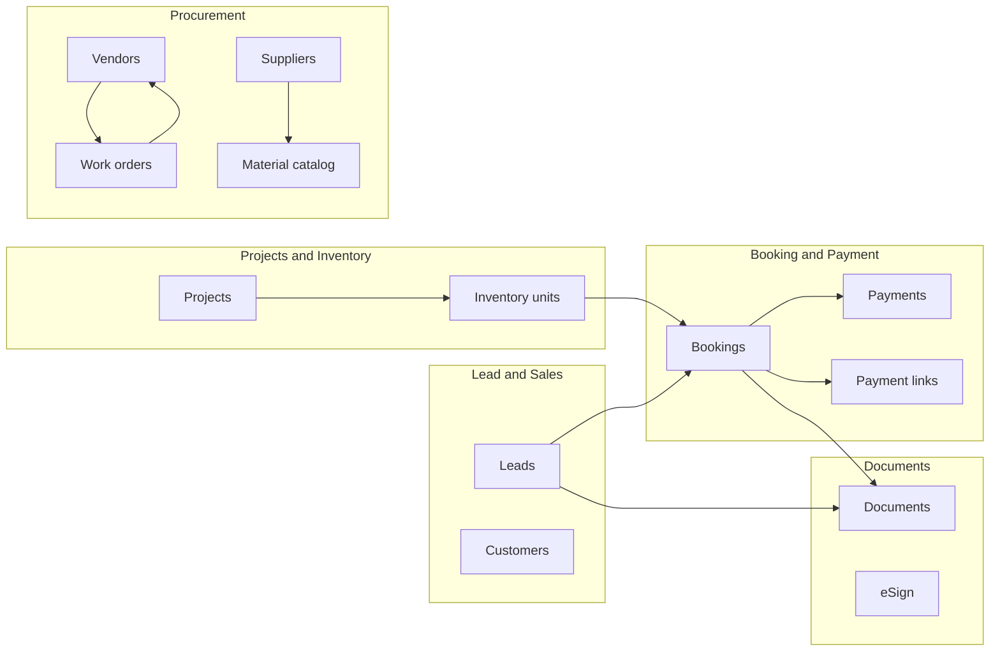

# ARRIS Company Admin — Functional Documentation

This folder documents the **Company Admin** product surface: navigation from `CompanyAdminSidebar`, related routes, UI patterns, and how modules connect.

## PDF export (single bundle)

- **File:** [ARRIS-Company-Admin-Documentation.pdf](./ARRIS-Company-Admin-Documentation.pdf) — one printable PDF (README + all module files).
- **Regenerate** (requires [Google Chrome](https://www.google.com/chrome/) and Node.js `npx`):

```powershell
cd docs/company-admin
./generate-pdf.ps1
```

Mermaid diagrams in the markdown appear as **code blocks** in the PDF (they are not rendered as graphics).

## Who this is for

- **Developers** onboarding to the Next.js frontend (`frontend/`)
- **Product / BA** stakeholders mapping screens to business capabilities
- **QA** planning regression around list → view → edit flows

## How the shell works

| Piece | Path / component | Role |
|--------|------------------|------|
| Company chrome (sidebar + navbar) | `CompanyAdminDashboardLayout` | Wraps `/company-admin/*` via `app/company-admin/layout.tsx`. Also imported by pages **outside** that prefix (e.g. `/leads`, `/projects-inventory`, `/work-orders`) so the same admin shell appears. |
| Sidebar definition | `src/components/layout/CompanyAdminSidebar.tsx` | Hub rows, flyouts (create / drafts / history shortcuts), `navItemIsActive` rules. |
| Hover / pin collapse | `useSidebarHoverCollapse` | Rail width and hover-expand behavior. |
| Global history UI | `/company-admin/history-logs` + `?module=` | Filterable audit trail; modules align with `HistoryModule` in `src/lib/historyLogs/types.ts`. |

## Tech stack (frontend)

- **Next.js App Router**, `'use client'` on interactive pages
- **Tailwind CSS 4**, shared `cn()` helper
- **State**: feature **singleton stores** under `src/lib/*Store.ts` (in-memory mock data; refresh clears unless persisted elsewhere)
- **Tables**: `DataTable` (`src/components/data-table/`) + column visibility, sorting, saved views via `globalSavedViewsStore`
- **AI**: `postAi` / `aiApi` for selective features (not all modules)

## Module index

| # | Module | Doc |
|---|--------|-----|
| 1 | Lead & Sales | [modules/01-lead-sales.md](./modules/01-lead-sales.md) |
| 2 | Projects & Inventory | [modules/02-projects-inventory.md](./modules/02-projects-inventory.md) |
| 3 | Booking & Payment | [modules/03-booking-payment.md](./modules/03-booking-payment.md) |
| 4 | Documents & Compliance | [modules/04-documents-compliance.md](./modules/04-documents-compliance.md) |
| 5 | Procurement (catalog, pricing, capacity, compliance) | [modules/05-procurement-management.md](./modules/05-procurement-management.md) |
| 6 | Vendor Management | [modules/06-vendor-management.md](./modules/06-vendor-management.md) |
| 7 | Supplier Management | [modules/07-supplier-management.md](./modules/07-supplier-management.md) |
| 8 | Work Orders | [modules/08-work-orders.md](./modules/08-work-orders.md) |

## Cross-module relationships (high level)



## Shared UX patterns (all modules)

1. **List / hub pages**: dense toolbars (search, filters, export, bulk actions where implemented), optional kanban (leads), pagination.
2. **Record layout**: breadcrumb + tabbed or sectioned **Record** components (`*RecordTabs.tsx`, `*DetailShell.tsx`).
3. **Create / view / edit**:
   - Many entities use **`/.../view/new`** or **`slug === 'new'`** for create on the same route family as view.
   - **Edit** often uses query param **`?edit=1`** (see `next.config.ts` redirect for leads: `/leads/edit/:slug` → `/leads/view/:slug?edit=1`).
4. **Drafts**: dedicated draft list routes (e.g. booking drafts, work order drafts) + client-side draft services where applicable (`draftService`, booking drafts).
5. **Saved views**: `globalSavedViewsStore` + `useGlobalSavedViewsSync` + route-scoped payloads (e.g. leads filters).
6. **History**: per-module links from sidebar flyouts to `/company-admin/history-logs?module=<id>`; hook `useHistoryLogs` filters `MOCK_HISTORY_LOGS`.

## Key source folders

| Area | Location |
|------|-----------|
| Company-admin routes | `src/app/company-admin/**` |
| Leads (outside prefix) | `src/app/leads/**`, `src/components/leads/**` |
| Projects / inventory | `src/app/projects-inventory/**`, `src/components/projects-inventory/**` |
| Work orders | `src/app/work-orders/**`, `src/components/work-orders/**` |
| Booking & payment UI | `src/components/booking-payment/**` |
| Documents & compliance UI | `src/components/documents-compliance/**` |
| Vendors | `src/components/vendors/**` |
| Suppliers | `src/components/suppliers/**` |
| Shared table | `src/components/data-table/**` |
| History types & mock | `src/lib/historyLogs/**` |

## Related repo docs

- Root agent guide: `AGENTS.md` (monorepo conventions, stores, Tailwind, edit-mode pattern).

---

*Generated from codebase analysis; routes and components reflect the repository at documentation time.*
