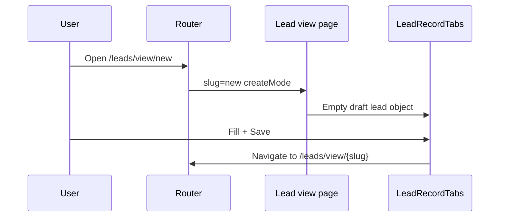

# Module 1 — Lead & Sales

## 1. Module purpose

| Audience | Explanation |
|----------|-------------|
| **Business** | Captures demand: prospects (leads), nurtures them through status and assignments, and supports intelligence and analytics alongside bookings and projects. |
| **Technical** | Primary data in `leadStore`; list and record UIs in `components/leads`. Routes mostly live under **`/leads`** (not under `/company-admin`), but the **Company Admin sidebar** exposes them as “Lead & Sales”. Shell: `CompanyAdminDashboardLayout` (used inside list page content). |
| **User flow** | Land on **Leads** table → open a lead **view** (tabs) → optionally **edit** (`?edit=1`) → related actions (assign, archive, export). Parallel entry: **Create** via `/leads/view/new` or flyout “Create Lead”. |

**Why it exists:** Central pipeline for revenue operations before and alongside **bookings** and **projects**.

---

## 2. Main features

- **Table / list** (`LeadsListPageContent`): pagination, column picker, sorting, filters drawer, bulk selection, bulk status / assign / delete, CSV & print-style export, saved views, import modal (`?import=1`).
- **Kanban** view toggle (same store data, different presentation).
- **Search** debounced / draft search field tied to filter payload.
- **Archived leads** (`/leads/archived`), **drafts** (`/leads/drafts`).
- **Lead record** (`LeadRecordTabs`): multi-tab overview + deep sections (assignment, follow-ups, site visits, pipeline, conversion, broker, notifications, linked bookings/payments, etc. — see component for full tab set).
- **Edit / create**: unified **`/leads/view/[slug]`** with `slug === 'new'` for create; edit query per `next.config` redirect from legacy `/leads/edit/:slug`.
- **Intelligence** (`/leads/intelligence`), **Analytics** (`/leads/analytics`), **AI Demand Intelligence** (`/demand-intelligence` — sidebar under same group).
- **Customer & Buyer Portal** (`/platform/customers`) — converted leads with booking/payment workspace; see `customersStore.ts`, `CustomersListPageContent`, `CustomerRecordTabs`.
---

## 3. Page structure

| Route | Purpose | Main components |
|-------|---------|-----------------|
| `/leads` | Main leads hub | `LeadsListPageContent`, `DataTable`, `LeadsKanbanBoard`, `ImportLeadsModal` |
| `/leads/view/new` | Create lead (same architecture as view) | `LeadRecordTabs`, `LeadDetailShell` |
| `/leads/view/[slug]` | View / edit lead | `LeadRecordTabs`, `getLeadBySlugIncludingArchived` |
| `/leads/create` | May redirect / legacy create path | Check app route |
| `/leads/drafts` | Draft list | Draft-focused list UI |
| `/leads/archived` | Archived list | Archive store slice |
| `/leads/intelligence` | Demand / intel dashboard | Intelligence store + UI |
| `/leads/analytics` | Analytics | Charts / aggregates |
| `/leads/[slug]/*` | Feature-specific subpages (site-visit, pipeline, …) | Feature pages |
| `/demand-intelligence` | AI demand (sidebar sibling) | Demand intelligence module |

**Layouts:** No `app/leads/layout.tsx`; pages embed **`CompanyAdminDashboardLayout`** where the full admin chrome is required.

---

## 4. Table page analysis (Leads list)

- **Columns (data ids):** `name`, `email`, `phone`, `source`, `project`, `budgetRange`, `preferredUnitType`, `status`, `assignedTo`, `createdDate` (+ always `actions`). Defaults defined in `LEADS_TABLE_DEFAULT_ON` in `LeadsListPageContent.tsx`.
- **Filters:** Rich `LeadsFilterPayload` (search, status, source, project, date range, etc.) — see type in same file.
- **Search:** `searchDraft` / `searchTerm` integrated into filter payload.
- **Bulk:** Selected row IDs → bulk assign, bulk status, bulk delete (store functions).
- **Row actions:** `LeadRowActionsMenu` (view, archive, delete, etc.).
- **Pagination:** `ITEMS_PER_PAGE = 10`, `Pagination` component.
- **Export:** `downloadLeadsCsv`, `openLeadsPrintReport`; scope = selection or filtered set.
- **Saved views:** `loadGlobalSavedViews` filtered by normalized pathname; `useConsumePendingSavedView` applies pending payload from navigation; legacy import from `mySFT-leads-saved-views`.
- **Status:** `LeadStatusBadge`.
- **Import:** `ImportLeadsModal` when `?import=1`.

---

## 5. View page analysis (Lead record)

- **Shell:** `LeadDetailShell` (breadcrumb, actions, not-found).
- **Tabs:** `LeadRecordTabs` aggregates overview, inline editors, related data, attachments, activity, **linked bookings / payments** (cross-module).
- **Meta / toolbar:** Sticky actions pattern inside tab components (save, cancel) varies by tab.
- **Validation:** Tab-level and overview validators (see `*FormValidation` / inline validation in components).
- **Drafts:** Draft storage patterns where enabled (session/local draft keys — inspect `LeadRecordTabs` and draft hooks if extending).

---

## 6. Create / edit flow

- **Same-page create:** `createMode` derived from slug; synthetic draft object built in `page.tsx`.
- **Edit:** Prefer **`?edit=1`** on view URL (global convention in AGENTS.md).
- **Redirects:** Permanent redirect from `/leads/edit/:slug` to view + edit query (`next.config.ts`).

---

## 7. History system

- **Module id:** `leads` (see `HISTORY_MODULES` in `historyLogs/types.ts`).
- **Sidebar:** Flyout “Leads history” → `/company-admin/history-logs?module=leads`.
- **Record-level:** Activity / thread data inside lead store (`activityLog`, `threadNotes`) complements global audit mock.

---

## 8. Relationships

| From | To | Mechanism |
|------|-----|-----------|
| Leads | Bookings | `linkedBookings` on lead; booking create can prefill `leadCode` query |
| Leads | Payments | `linkedPayments` display in record |
| Leads | Projects | `project` field / filters |
| Leads | Customers | Admin customers views by lead slug |
| Leads | Documents | Optional linkage via compliance flows (downstream) |

---

## 9. UI / UX patterns

- Enterprise **DataTable** with column visibility popover (`LuColumns3`).
- **Saved views** drawer (`LuBookmark`).
- **Bulk bar** when selection non-empty.
- **Kanban / Table** toggle for pipeline visibility.

---

## 10. Architecture notes

| Topic | Location |
|-------|----------|
| Store API | `src/lib/leadStore.ts` |
| Routes helper | `src/lib/leadRoutes.ts` (`leadProfileHref`, etc.) |
| CSV export | `src/lib/exportLeadsCsv.ts` |
| PDF / print | `src/lib/exportLeadsPdf.ts` |
| Intelligence store | `src/lib/leadsIntelligenceStore.ts` |
| Global saved views | `src/lib/globalSavedViewsStore.ts` |

**Beginner tip:** Start at `app/leads/page.tsx` → `LeadsListPageContent` → `app/leads/view/[slug]/page.tsx` → `LeadRecordTabs.tsx` (large but authoritative).
