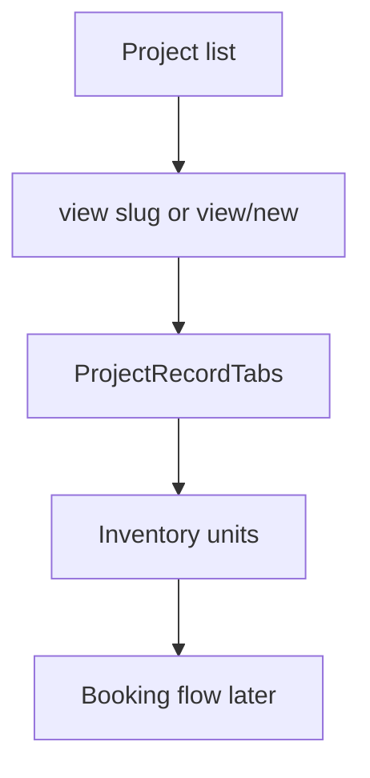

# Module 2 — Projects & Inventory Management

## 1. Module purpose

| Audience | Explanation |
|----------|-------------|
| **Business** | Defines **projects** (buildings/phases) and **inventory units** (sellable stock), pricing context, visual floor mapping, and analytics — upstream of **bookings** and **payments**. |
| **Technical** | Routes under **`/projects-inventory/*`**. Stores: `projectStore`, inventory-related stores (see `lib/*` imports in `ProjectRecordTabs` / list pages). Canvas/visual routes use Konva patterns per AGENTS.md. |
| **User flow** | Project list → open **project view** (tabs: overview, units, pricing hooks, etc.) → create/edit units from inventory hub → dashboards / AI insights for portfolio visibility. |

---

## 2. Main features

- **Project list** with filters, saved views, export patterns (see `ProjectsListPageContent` / analogous list components).
- **Project create** `/projects-inventory/projects/create` and **view/new** pattern for unified create.
- **Project drafts** `/projects-inventory/projects/drafts`.
- **Inventory list** `/projects-inventory/inventory`, **create**, **view/[slug]**, **edit/[slug]**.
- **Pricing** hub `/projects-inventory/pricing`.
- **Visual mapping** & **visual inventory view** (canvas-heavy).
- **Inventory dashboard** & **Analytics** & **AI insights** pages.
- **Record tabs** on project: `ProjectRecordTabs` (large component — phases, media, inventory linkage, approvals, etc.).

---

## 3. Page structure

| Route | Purpose |
|-------|---------|
| `/projects-inventory/projects` | Project table hub |
| `/projects-inventory/projects/create` | Create flow entry |
| `/projects-inventory/projects/view/new` | Alternate unified create URL (sidebar flyout) |
| `/projects-inventory/projects/view/[slug]` | Project record |
| `/projects-inventory/projects/drafts` | Draft projects |
| `/projects-inventory/inventory` | Units table |
| `/projects-inventory/inventory/create` | Add unit |
| `/projects-inventory/inventory/view/[slug]` | Unit record |
| `/projects-inventory/inventory/edit/[slug]` | Unit edit |
| `/projects-inventory/pricing` | Pricing workspace |
| `/projects-inventory/visual-inventory-mapping` | Visual mapper |
| `/projects-inventory/visual-inventory-view` | Visual reader |
| `/projects-inventory/inventory-dashboard` | KPI-style dashboard |
| `/projects-inventory/analytics` | Analytics |
| `/projects-inventory/ai-insights` | AI narrative / insights |

**Shell:** Pages compose **`CompanyAdminDashboardLayout`** for sidebar alignment (same as leads).

**Sidebar flyouts** (`CompanyAdminSidebar.tsx`):

- **Project Setup:** create (→ view/new), drafts, **history** → `?module=projects`.
- **Inventory:** add unit, **history** → `?module=inventory`.

---

## 4. Table page analysis

- **Projects / inventory lists** follow the shared **DataTable** pattern: sortable columns, filters, optional export (see respective `*ListPageContent.tsx` files under `components/projects-inventory/`).
- **Pagination / empty states:** consistent with leads (per-page limits in each list module).
- **Row actions:** open view, edit slug routes, sometimes inline status.

*(Exact column ids vary by list file — inspect `ProjectsListPageContent` / inventory list component for authoritative IDs.)*

---

## 5. View page analysis

- **`ProjectRecordTabs`:** primary project **record** surface; includes overview cards, inventory ties, documents hooks, and workflow sections.
- **Inline editing:** sections use controlled fields + save bars inside tabs.
- **Validation:** project / inventory validation modules in `lib/*FormValidation.ts` (naming pattern).

---

## 6. Create / edit flow

- **Projects:** Flyout links `projects/create` with **`linkHref` to `projects/view/new`** (same unified create pattern as leads).
- **Inventory:** Dedicated **create** route and **edit/[slug]** for units.
- **Drafts:** `projects/drafts` list recovers in-progress records.

---

## 7. History system

- **Modules:** `projects`, `inventory`, `pricing` exist in `HISTORY_MODULES` for global logs.
- **Sidebar links:** `history-logs?module=projects` and `?module=inventory` from flyouts.

---

## 8. Relationships

| From | To | Notes |
|------|-----|-------|
| Projects | Inventory units | Unit records reference project |
| Inventory | Bookings | Booking captures `unitId` / project name options from `bookingPaymentMockStore.getProjectOptions` |
| Projects | Pricing | Shared commercial context |
| Projects | Leads | Lead “project” filter / association |

---

## 9. UI / UX patterns

- **Hub + flyout** navigation for nested actions (create, drafts, history).
- **Konva** for visual mapping pages (imperative canvas — sync carefully with React state).
- **Breadcrumbs** on nested create/edit pages.

---

## 10. Architecture notes

| Topic | Location |
|-------|----------|
| Project UI | `src/components/projects-inventory/` |
| App routes | `src/app/projects-inventory/**` |
| Stores | `src/lib/projectStore.ts`, inventory stores (grep `inventory` under `lib/`) |
| Sidebar active rules | `navItemIsActive` for `/projects-inventory/projects` and `inventory` paths — excludes `/create` children where needed |

**Beginner tip:** Open `ProjectRecordTabs.tsx` and search for `tabs` / `TAB` definitions to map the business sections quickly.
