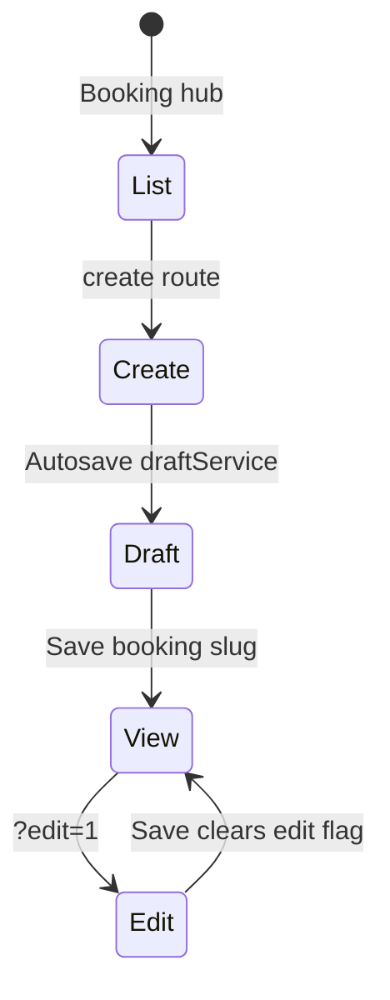

# Module 3 — Booking & Payment Tracking

## 1. Module purpose

| Audience | Explanation |
|----------|-------------|
| **Business** | Converts demand into **bookings** (reservations against units), tracks **payments** and **installments**, issues **payment links**, and surfaces operational **reports**, **system** settings, and **AI** helpers for finance ops. |
| **Technical** | Routes live under **`/company-admin/booking-payment/*`** (plus **global history** at `/company-admin/history-logs`). Core mock orchestration in `bookingPaymentMockStore` (and related payment link stores). Wrapped by **`app/company-admin/layout.tsx`** → `CompanyAdminDashboardLayout`. |
| **User flow** | Booking hub → create booking (draft-capable) → view booking with tabs → add payments / link documents → payment hub for ledger / installments → payment links for outbound collection. |

---

## 2. Main features

- **Booking list** with hub flyout: create, **drafts**, history (`?module=bookings`).
- **Booking record tabs:** Overview, Payments, Documents, History (`BookingRecordTabs` + `BookingDetailView`).
- **Payments list / add / edit / view / installments** routes.
- **Payment links:** list, form, add, edit, view slug.
- **Reports** page.
- **Booking & Payment AI** dedicated page.
- **System** admin page for module configuration UI.
- **Draft service** integration for long forms (`draftService`, `BookingOverviewTab` draft state).
- **Return navigation** `returnTo` query sanitized via `safeInternalPath`.

---

## 3. Page structure

| Route | Purpose |
|-------|---------|
| `/company-admin/booking-payment/booking` | Booking table hub |
| `/company-admin/booking-payment/booking/create` | Create booking wizard entry |
| `/company-admin/booking-payment/booking/drafts` | Draft bookings |
| `/company-admin/booking-payment/booking/view/[slug]` | View / create (`new`) / edit (`?edit=1`) |
| `/company-admin/booking-payment/booking/edit/[slug]` | Redirect-style legacy → view + edit (check `edit/[slug]/page.tsx`) |
| `/company-admin/booking-payment/payments` | Payments hub |
| `/company-admin/booking-payment/payments/add` | Add payment (+ `returnTo`) |
| `/company-admin/booking-payment/payments/edit/[slug]` | Edit payment |
| `/company-admin/booking-payment/payments/view/[slug]` | Payment detail |
| `/company-admin/booking-payment/payments/installments` | Installments workspace |
| `/company-admin/booking-payment/payment-links` | Links list |
| `/company-admin/booking-payment/payment-links/form` | Link form |
| `/company-admin/booking-payment/payment-links/add` | Add link |
| `/company-admin/booking-payment/payment-links/edit/[slug]` | Edit |
| `/company-admin/booking-payment/payment-links/view/[slug]` | View |
| `/company-admin/booking-payment/reports` | Reports |
| `/company-admin/booking-payment/ai` | AI surface |
| `/company-admin/booking-payment/system` | System |
| `/company-admin/history-logs?module=bookings` | Scoped history |
| `/company-admin/history-logs?module=payments` | Scoped history (also linked from payment links flyout) |

**Key components:** `BookingRecordTabs`, `BookingDetailView`, `BookingOverviewTab`, `BookingStepperForm`, payment link components under `components/booking-payment/`.

---

## 4. Table page analysis

- **Bookings / payments / links** lists: `DataTable` or module-specific tables with **filters**, **row actions**, **status chips**, **export** where wired.
- **Payment links** standard form: `PaymentLinkFormStandard.tsx` (and variants).
- **Bulk / import:** varies by sub-page — inspect each `page.tsx` under `booking-payment/`.

---

## 5. View page analysis (Booking record)

**Tabs (`TAB_ITEMS` in `BookingRecordTabs.tsx`):**

| Tab key | Label | Role |
|---------|-------|------|
| `overview` | Overview | Primary fields, draft save, create vs edit vs view |
| `payments` | Payments | Ledger / payment summaries tied to booking |
| `documents` | Documents | Linked compliance docs |
| `history` | History | Change log / timeline for the booking |

- **URL tab switching:** `?tab=payments|documents|history` (default overview omits query).
- **Create mode:** `slug === 'new'`; draft keys and `activeDraftId` managed in `BookingRecordTabs`.
- **Edit mode:** `?edit=1` or `?edit=true`.
- **Lead prefill:** `leadCode` query from lead → booking handoff.

---

## 6. Create / edit flow

- **After save:** `goAfterSave` pushes `returnTo` if present, else `/company-admin/booking-payment/booking/view/{slug}`.
- **Drafts page:** resume from `booking/drafts`.

---

## 7. History system

- **Modules:** `bookings`, `payments` in `HISTORY_MODULES`.
- **Sidebar flyouts** link to filtered `history-logs`.
- **Tab “History”** on booking for record-scoped narrative (complements global log).

---

## 8. Relationships

| Entity | Connects to |
|--------|----------------|
| Booking | Lead (`leadId`, `leadCode`), Project/unit options from store |
| Payment | Booking slug / filters |
| Payment link | Booking / customer context in forms |
| Documents tab | Compliance document IDs (read-only / link UI) |

---

## 9. UI / UX patterns

- **Inline toasts:** `InlineToast` for save feedback.
- **Sticky save** on overview during create/edit.
- **Hub row `replaceLink`:** Payments hub clears stale `?booking=` when opened from sidebar (see sidebar comment).

---

## 10. Architecture notes

| Topic | Location |
|-------|----------|
| Store | `src/lib/bookingPaymentMockStore.ts` |
| Drafts | `src/lib/draftService.ts` |
| Record UI | `src/components/booking-payment/BookingRecordTabs.tsx` |
| Safe return | `src/lib/navigationReturn.ts` |

**Security note:** Always use **`safeInternalPath`** for `returnTo` to avoid open redirects when extending.
