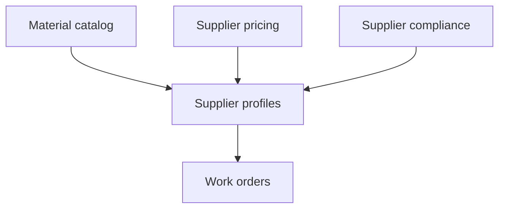

# Module 5 — Procurement Management (Catalog, Pricing, Capacity, Compliance)

## 1. Module purpose

| Audience | Explanation |
|----------|-------------|
| **Business** | Supports **strategic procurement** beyond individual vendor/supplier profiles: **material master data**, **supplier pricing**, **capacity planning**, and **supplier compliance** scoring — aligns purchasing with projects and work execution. |
| **Technical** | Routes under **`/company-admin/procurement/*`**. These pages are **first-class** in the **Supplier management** sidebar flyout (see `SUPPLIER_MANAGEMENT_FLYOUT` in `CompanyAdminSidebar.tsx`) alongside supplier CRUD. |
| **User flow** | From supplier hub flyout → open catalog / pricing / capacity / compliance → adjust master data → downstream **work orders** and **supplier** records consume context. |

> **Note:** “Procurement Management” in the sidebar is a **parent group** that also contains Vendor, Supplier, and Work Orders modules (docs **06–08**). **This file** focuses on the **`/company-admin/procurement/...`** analytics/catalog surfaces.

---

## 2. Main features

| Feature | Route (typical) |
|---------|-----------------|
| Material master catalog | `/company-admin/procurement/material-catalog` |
| Supplier pricing | `/company-admin/procurement/supplier-pricing` |
| Supply capacity | `/company-admin/procurement/supply-capacity` |
| Supplier compliance dashboard | `/company-admin/procurement/supplier-compliance` |

- **Table-heavy** pages with filters (per implementation in each `page.tsx`).
- **Export / KPI cards** where present (inspect each page).

---

## 3. Page structure

| Route | Purpose | Components |
|-------|---------|------------|
| `.../material-catalog` | SKU / material rows | Page-local tables + actions |
| `.../supplier-pricing` | Price lists / tiers | Pricing UI |
| `.../supply-capacity` | Capacity vs demand | Charts / tables |
| `.../supplier-compliance` | Compliance checklist / scores | Compliance UI |

**Shell:** Inherits **`app/company-admin/layout.tsx`** (full admin chrome).

**Navigation entry:** Sidebar → **Procurement Management** → **Supplier management** flyout includes these links (not duplicated on vendor flyout).

---

## 4. Table page analysis

- Expect **DataTable** or bespoke tables with **column definitions inline** in each page file.
- **Filters:** search + facet filters (verify in source).
- **Row actions:** drill to supplier or material where linking exists.

---

## 5. View page analysis

- Mostly **single-page analytics** (less multi-tab than leads/bookings). If tabs exist, they are local `useState` tab bars in the page component.

---

## 6. Create / edit flow

- Typically **inline edit** or **modal** create for catalog rows (check `material-catalog/page.tsx` for patterns).
- No global `?edit=1` convention here unless a record view was added later — prefer reading the page component.

---

## 7. History system

- Global history modules include **`suppliers`**; procurement operations may log under suppliers or future `procurement` module if backend extends `HISTORY_MODULES`.
- Today: use **`/company-admin/history-logs?module=suppliers`** for supplier-related audit when wiring events.

---

## 8. Relationships

---

## 9. UI / UX patterns

- Consistent **company** blue styling (`variant="company"` buttons).
- **Breadcrumbs** optional; many procurement pages use page header only.

---

## 10. Architecture notes

| Topic | Location |
|-------|----------|
| App routes | `src/app/company-admin/procurement/**` |
| Supplier linkage | `src/lib/suppliers/*`, `components/suppliers/*` |
| Cross-links from companies UI | `companies/page.tsx` materials tile → `material-catalog` (post-refactor) |

**Beginner tip:** Cross-check **`CompanyAdminSidebar.tsx`** `SUPPLIER_MANAGEMENT_FLYOUT` whenever you add a procurement route so the flyout stays authoritative for discoverability.
